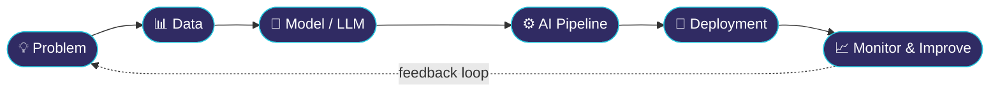

<!-- ═══════════════════════════════════════════════════════════════ -->

<!--                    NAREN KG — GITHUB PROFILE                   -->

<!-- ═══════════════════════════════════════════════════════════════ -->

<div align="center">


<a href="https://git.io/typing-svg">

</a>

<br/><br/>


<br/>


</div>

<br/>

<!-- ═══════════════════════════════════════════════════════════════ -->

<!--                         TERMINAL                               -->

<!-- ═══════════════════════════════════════════════════════════════ -->

```console
naren@ai-lab:~$ whoami

> Naren KG
> AI / ML Engineer
> B.E. Artificial Intelligence & Machine Learning
> Sri Eshwar College of Engineering

naren@ai-lab:~$ cat mission.txt

> Build intelligent systems that solve real-world problems.

naren@ai-lab:~$ ./currently_building.sh

> 🤖 Agentic AI systems
> 🧠 Deep Learning & Machine Learning applications
> 👁️ Computer Vision systems
> 🔎 Retrieval-Augmented Generation
> ⚡ Production-ready AI APIs

naren@ai-lab:~$ echo $PHILOSOPHY

> Learn → Build → Deploy → Iterate
```

<br/>

<!-- ═══════════════════════════════════════════════════════════════ -->

<!--                         ABOUT                                   -->

<!-- ═══════════════════════════════════════════════════════════════ -->

## 🧭  The Story So Far

I'm **Naren KG**, an **AI / ML Engineer** focused on building practical intelligent systems across **Machine Learning, Deep Learning, Generative AI, Agentic AI, and Computer Vision**.

I'm currently pursuing my **B.E. in Artificial Intelligence & Machine Learning at Sri Eshwar College of Engineering**, with an expected graduation in **2027**.

My work revolves around turning AI concepts into working products — from **real-time computer vision systems** and **AI proctoring** to **RAG pipelines, AI agents, and full-stack AI applications**.

> **Build models. Connect intelligence. Ship products.**

<br/>

<!-- ═══════════════════════════════════════════════════════════════ -->

<!--                         AI WORKFLOW                             -->

<!-- ═══════════════════════════════════════════════════════════════ -->

## 🔁  How I Build AI Systems



<br/>

<!-- ═══════════════════════════════════════════════════════════════ -->

<!--                         SKILLS                                 -->

<!-- ═══════════════════════════════════════════════════════════════ -->

## ⚔️  AI Engineering Stack

<table>
<tr>
<td width="190"><b>🐍 Programming</b></td>
<td>


</td>
</tr>

<tr>
<td><b>🧠 AI / ML</b></td>
<td>


</td>
</tr>

<tr>
<td><b>🔥 Frameworks</b></td>
<td>


</td>
</tr>

<tr>
<td><b>📊 Data Science</b></td>
<td>


</td>
</tr>

<tr>
<td><b>🌐 Web & Databases</b></td>
<td>


</td>
</tr>

<tr>
<td><b>🛠️ Developer Tools</b></td>
<td>


</td>
</tr>

<tr>
<td><b>🤖 AI Tools</b></td>
<td>

`GitHub Copilot` `Trae.ai` `Windsurf` `Google AI Studio` `n8n`

</td>
</tr>

</table>

<br/>

<!-- ═══════════════════════════════════════════════════════════════ -->

<!--                         EXPERIENCE                             -->

<!-- ═══════════════════════════════════════════════════════════════ -->

## 💼  Experience

### 🤖 Machine Learning Engineer Intern

**Payoda Technologies · Coimbatore, Tamil Nadu · Feb 2026**

Worked on AI-powered real-time behavioral monitoring systems involving:

* 📱 Mobile phone detection using trained ML models
* 👥 Multiple-person presence detection
* 🚫 No-person detection
* 👁️ Gaze tracking integration
* 👄 Lip-sync analysis
* 🧠 ML pipeline integration for enhanced assessment monitoring

<br/>

<!-- ═══════════════════════════════════════════════════════════════ -->

<!--                         PROJECTS                                -->

<!-- ═══════════════════════════════════════════════════════════════ -->

## 🚀  Featured Projects

<table>
<tr>

<td width="50%" valign="top">

### 🤖 AI Proctoring System

**AI-powered assessment monitoring platform**

A computer-vision-driven proctoring system designed to monitor candidate behavior during assessments.

**Key capabilities**

* 📱 Mobile phone detection
* 👥 Multiple-person detection
* 🚫 No-person detection
* 👁️ Gaze direction tracking
* 👄 Lip-sync verification
* 🧠 Trained ML models for behavioral analysis

**Focus**

`Computer Vision` `Machine Learning` `Deep Learning` `Behavior Analysis`

</td>

<td width="50%" valign="top">

### 🛵 SafeRide Rewards

**AI-powered road safety application**

An application that enables citizens to report helmetless riders using GPS-tagged photographs.

**Key capabilities**

* 📍 GPS-tagged image reporting
* 📸 Image-based verification
* 🤖 AI-powered validation
* ⛽ Reward redemption through petrol stations

**Focus**

`AI` `Computer Vision` `GPS` `Image Verification`

</td>

</tr>

<tr>

<td width="50%" valign="top">

### 🌿 Glow 24

**Hair & skincare e-commerce platform**

A dynamic e-commerce website developed for a hair and skincare product business.

**Key capabilities**

* 🛍️ Product-focused e-commerce experience
* 🎨 User-friendly interface
* 📊 Business-oriented dashboard
* 🧴 Hair & skincare product management
* 📱 Responsive customer experience

**Focus**

`Web Development` `E-Commerce` `UI/UX` `Business Automation`

</td>

<td width="50%" valign="top">

### 🤖 AI Agent Collection

**Practical AI automation experiments**

A collection of focused AI tools and agents built around everyday automation and intelligent workflows.

**Agents**

* 🔐 Password Saver
* 📱 QR Generator
* 📧 Spam Email Detector

**Focus**

`AI Agents` `Automation` `Generative AI` `Python`

</td>

</tr>
</table>

<br/>

<!-- ═══════════════════════════════════════════════════════════════ -->

<!--                         CORE CONCEPTS                           -->

<!-- ═══════════════════════════════════════════════════════════════ -->

## 🧠  Core AI Concepts

```text
Machine Learning
      │
      ├── Supervised Learning
      ├── Model Training
      ├── Classification
      └── Prediction
            │
            ▼
Deep Learning
      │
      ├── Neural Networks
      ├── Computer Vision
      └── Behavioral Analysis
            │
            ▼
Generative AI
      │
      ├── LLM Applications
      ├── RAG
      ├── Vector Databases
      └── LangChain
            │
            ▼
Agentic AI
      │
      ├── AI Agents
      ├── LangGraph
      ├── Tool Calling
      └── Workflow Automation
```

<br/>

<!-- ═══════════════════════════════════════════════════════════════ -->

<!--                         EDUCATION                              -->

<!-- ═══════════════════════════════════════════════════════════════ -->

## 🎓  Education

### Sri Eshwar College of Engineering

**B.E. Artificial Intelligence & Machine Learning**

`Expected 2027`

**CGPA: 8.04 / 10**

📍 Tamil Nadu, India

<br/>

### Bharatiya Vidya Bhavan School

**Matriculation**

`2021 – 2023`

**Percentage: 72.1%**

📍 Tamil Nadu, India

<br/>

<!-- ═══════════════════════════════════════════════════════════════ -->

<!--                         CERTIFICATIONS                         -->

<!-- ═══════════════════════════════════════════════════════════════ -->

## 📜  Certifications

| Certification                                           | Organization      | Year |
| ------------------------------------------------------- | ----------------- | ---: |
| 🧠 Machine Learning Specialization                      | DeepLearning.AI   | 2024 |
| ☁️ Introduction to Cloud Computing                      | NPTEL             | 2024 |
| ☁️ AWS Cloud Practitioner                               | AWS Skill Builder | 2024 |
| 💻 Mastering Data Structures & Algorithms using C & C++ | Udemy             | 2023 |
| ☕ Learn JAVA Programming – Beginner to Master           | SkillRack         | 2023 |

<br/>

<!-- ═══════════════════════════════════════════════════════════════ -->

<!--                         ACHIEVEMENTS                            -->

<!-- ═══════════════════════════════════════════════════════════════ -->

## 🏆  Achievements

| 🏅 | Achievement                                                      |
| -- | ---------------------------------------------------------------- |
| 🥇 | **Hack IT On Secured — 1st Place** among 300 participants · 2025 |
| 🥇 | **FESTRONIX — 1st Place** among Top 50 teams · 2025              |
| 🌍 | **AI CREDIT COURSE — International Course Program** · 2025       |
| 🥇 | **NEURA NEXA [Hack Attack] — 1st Place** · 2025                  |
| 🥇 | **FRESHATHON — 1st Place** in Project Expo · 2023                |
| 🏅 | **KADALKALAM — 5th Position** with TN CARD · 2025                |

<br/>

<!-- ═══════════════════════════════════════════════════════════════ -->

<!--                         CURRENTLY EXPLORING                     -->

<!-- ═══════════════════════════════════════════════════════════════ -->

## 🔬  Currently Exploring

```python
naren = {

    "role": "AI / ML Engineer",

    "specialization": [
        "Machine Learning",
        "Deep Learning",
        "Generative AI",
        "Agentic AI",
        "Computer Vision"
    ],

    "building": [
        "AI Agents",
        "RAG Systems",
        "AI Automation",
        "Production ML Applications"
    ],

    "stack": [
        "Python",
        "TensorFlow",
        "PyTorch",
        "LangChain",
        "LangGraph",
        "FastAPI"
    ],

    "mindset": "Learn → Build → Deploy → Iterate"

}
```

<br/>

<!-- ═══════════════════════════════════════════════════════════════ -->

<!--                         GITHUB                                  -->

<!-- ═══════════════════════════════════════════════════════════════ -->

## 📊  GitHub Activity

<div align="center">


<br/><br/>


</div>

<br/>

<!-- ═══════════════════════════════════════════════════════════════ -->

<!--                         CONNECT                                -->

<!-- ═══════════════════════════════════════════════════════════════ -->

## 🤝  Let's Build Something

Interested in **AI, Machine Learning, Agentic AI, Computer Vision, or AI-powered products?**

Let's connect and build something useful.

<div align="center">

<a href="mailto:naren1872005@zohomail.in">

</a>

<a href="https://www.linkedin.com/">

</a>

<a href="https://github.com/naren1872005">

</a>

</div>

<br/>

<div align="center">

**⚡ AI isn't just something I study — it's something I build.**

</div>


